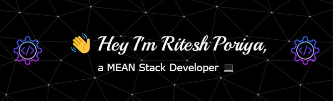

# Ritesh Poriya`s MEAN Stack Developer

## 👋 Hello World!

I'm Ritesh Poriya, a passionate and experienced MEAN Stack Developer with a knack for turning ideas into reality. My expertise spans across the entire web development stack, from front-end to back-end, and I thrive in creating robust, scalable, and user-friendly applications.

## 🚀 About Me

- 🚀 Experienced Web Developer with a passion for problem-solving and innovative solutions 💻 
- 🌱 I'm always learning and exploring new technologies to stay at the forefront of the ever-evolving tech landscape.
- 💬 Ask me about Any Technology or Framework you're passionate about.
- 📫 How to reach me: riteshporiya124@gmail.com or [LinkedIn](https://www.linkedin.com/in/riteshporiyawebdev/).
- 😄 Pronouns: He/Him
- 🌐 Check out my portfolio: [Portfolio](https://riteshporiya.dev)

## 🌐 Socials:
  

# 💻 Languages

# 🚀 Frameworks/Mobile

### 🛢️ Databases

### ☁  Cloud

### 🛠️ IDEs

# 📊 GitHub Stats:
  
  

## 🏆 GitHub Trophies

### ✍️ Random Dev Quote

### 🔝 Top Contributed Repo

